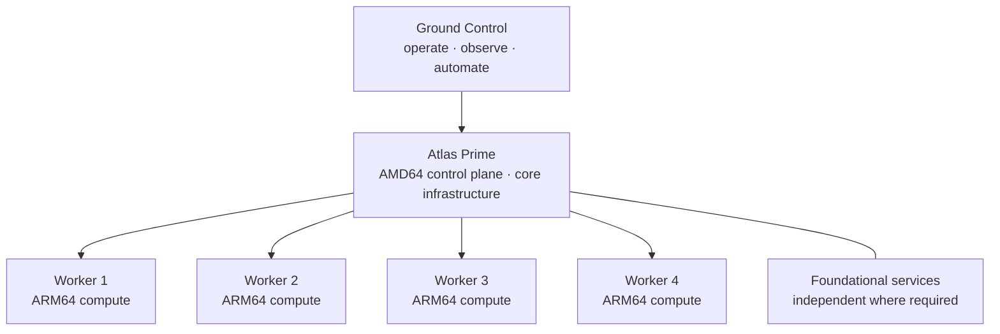
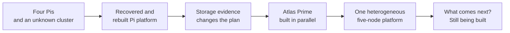

# PROJECT ATLAS

<!--
VISUAL PLACEMENT 1 — ATLAS HERO / BANNER

A wide, unmistakably Atlas image belongs here: physical infrastructure,
experimentation, and a sense that the project is still moving. Keep it
stylized or abstract. Do not include readable screens, labels, addresses,
identifiers, port maps, or enough physical detail to reconstruct the lab.

Publish only after Team Atlas reviews the exact final asset and crop.
-->

  <strong>Don’t just read about what’s next. Build it.</strong>

What started with four Raspberry Pis in a closet has become my personal
technology laboratory—a real mini-datacenter for getting hands-on with the
technologies reshaping AI, cybersecurity, cloud infrastructure, and modern
applications.

I built Atlas because I learn best by building. It gives me a place to take the
technologies I encounter across AI, cybersecurity, cloud, and industry and
experience them firsthand: build the infrastructure, observe it, break it,
understand why it failed, recover it, secure it, and then build something
harder.

Today, Atlas runs a heterogeneous compute platform built around a dedicated
AMD64 control plane and four ARM64 Raspberry Pi workers. But Kubernetes isn’t
Project Atlas.

> **Kubernetes is the launchpad.**

Atlas is where Team Atlas will explore persistent infrastructure,
observability, cybersecurity, AI agents, MCP, local models, hybrid cloud, real
applications—and technologies that are not on the list yet.

This repository documents the journey: what worked, what failed, the decisions
that changed the architecture, and what we learned by building it.

## Built in a closet. Designed to go much further.

<!--
VISUAL PLACEMENT 2 — REVIEWED PHYSICAL ATLAS PHOTOGRAPH

Place the real closet/rack photograph here once the exact source image and
final crop pass Team Atlas review. Check screens, labels, serial numbers,
asset tags, papers, reflections, cable/port clues, surrounding objects,
location clues, and embedded metadata. Do not publish the photograph before
that review.
-->

Atlas is physical infrastructure. Hardware gets chosen. Cables get pulled.
Power fails. Storage behaves differently from the diagram. Reboots reveal what
was never truly persistent.

That is part of the point. The lab is small enough to understand, real enough
to fight back, and open-ended enough to keep asking harder questions.

## Atlas today

| 5 nodes | 2 architectures | 1 control plane |
|:---:|:---:|:---:|
| **4 compute workers** | **13 completed milestones** | **1 retired legacy cluster** |

<!--
VISUAL PLACEMENT 3 — SANITIZED CURRENT ARCHITECTURE

Replace the Mermaid diagram below with a polished branded rendering when the
visual system is ready. Preserve role-level architecture only. Do not add
addresses, exact network topology, device identifiers, access paths, security
rules, recovery mechanics, or workload-placement details.
-->

Atlas Prime provides the current Kubernetes control plane and its dedicated
storage foundation. The four Pis provide the compute fleet. Foundational
services stay outside the cluster when bootstrap and recovery require that
independence.

This is intentionally a role-level view, not a map of the live environment.
The deeper, still-sanitized design is in the
[migration-era architecture](docs/architecture/migration-era-diagrams.md).

## North Star

There is no finished Atlas architecture. That is intentional.

It exists to keep building and learning: deploy something real, observe it,
break it safely, recover it, secure the new boundary, automate what should be
repeatable, and use the result to attempt something harder.

Kubernetes is the current foundation—not the destination. Atlas should become
a place to run applications, infrastructure experiments, security research,
AI systems, local and cloud services, and whatever matters next.

When we are deciding whether something belongs in Atlas, the questions are
simple:

- Will it make the platform more capable?
- Will it teach us something relevant to infrastructure, security, cloud, or
  AI?
- Can we build something real with it?
- Can we observe it, automate it, recover it, and explain what we learned?

If the answer is yes, it probably belongs here.

## The journey

One technical problem kept leading to the next.

The first job was not installation. It was discovery. The four Pis already
contained an inherited Kubernetes environment whose architecture and health
needed to be rediscovered. Recovering it exposed how Linux, containerd,
kubelet, networking, metrics, and the Kubernetes datastore affected one
another.

Once the cluster was healthy, its unsupported operating system forced a
rebuild. The rebuild made the fleet reproducible. Reproducibility made it
possible to reconstruct the control plane and reconnect the workers. That made
storage the next real question.

Storage preparation worked—but the evidence changed the plan. A
microSD-centered platform was not the right foundation for the latency and
endurance demands Atlas was growing toward. Instead of protecting the original
architecture, Team Atlas introduced Atlas Prime and built a successor beside
the still-working Pi cluster.

That decision opened the most interesting chapter so far: independent DNS, a
parallel control plane, dedicated automation, rollback, heterogeneous worker
migration, retirement of the original cluster, and a deliberate cold-start
recovery test.

<!--
VISUAL PLACEMENT 4 — ATLAS EVOLUTION

Turn the evolution below into a compact visual timeline. The visual should
show increasing capability and changing architecture without depicting the
live network. Keep the unfinished future visible.
-->

### Era I — Discovery & Recovery

The project began by understanding what was already in the closet, recovering
the inherited cluster, and adding the first visibility into how it behaved.

| Milestone | What changed |
|---|---|
| [001 — Lab Discovery](docs/milestones/001-lab-discovery.md) | Turn an unknown rack into an understood starting point. |
| [002 — Kubernetes Foundation](docs/milestones/002-kubernetes-foundation.md) | Recover the original cluster and prove the fixes survived reboot. |
| [003 — Resource Metrics](docs/milestones/003-resource-metrics.md) | Add early resource visibility—and document the trust limitation that came with it. |

### Era II — The Pi Platform

Recovery proved the cluster could work. Modernization made it supportable and
repeatable. Networking brought the fleet back together. Storage preparation
then produced the evidence that would outgrow the architecture.

| Milestone | What changed |
|---|---|
| [004 — Platform Modernization](docs/milestones/004-platform-modernization.md) | Replace an end-of-life foundation with a supported, reproducible one. |
| [005 — Control Plane Reconstitution](docs/milestones/005-control-plane-reconstitution.md) | Build a clean control plane from understood state. |
| [006 — Cluster Networking and Worker Rejoin](docs/milestones/006-cluster-networking-and-worker-rejoin.md) | Restore pod networking, DNS, real traffic, and the worker fleet. |
| [007 — Persistent Storage Preparation](docs/milestones/007-persistent-storage-preparation.md) | Prove durable device handling—and learn why the larger storage design needed to change. |

### Era III — Enter Atlas Prime

Atlas Prime was not a bigger replacement dropped into the rack. It was built
beside a healthy cluster, one dependency at a time, while the old control plane
remained available for recovery.

This is where the lab started pushing back. A DNS cutover failed and rollback
worked. A worker reached `Ready` but failed the end-to-end test. Validators
sometimes reported failure while the infrastructure was healthy, exposing
assumptions about DNS, scheduling, automation, and the meaning of a passing
check.

The lesson was bigger than any one incident: test real behavior, test the
rollback, and question the measurement as carefully as the system being
measured.

Eventually the canaries stopped producing new information. Team Atlas kept the
checks that protected valuable state and dropped the ceremony that protected
disposable experiments. The remaining fleet moved, the old control plane was
retired, and its Pi returned as worker4.

The closing recovery tests reinforced another lesson: recovery is itself an
architecture test. Power behavior and durable machine identity exposed
dependencies that normal operation had hidden. Atlas recovered, and the
remaining unattended power-recovery gap stays explicit rather than becoming a
capability the project pretends to have.

| Milestone | What changed |
|---|---|
| [008 — Architecture Pivot and Atlas Prime Commissioning](docs/milestones/008-atlas-prime-commissioning.md) | Establish the stronger AMD64 foundation without discarding the working cluster. |
| [009 — Independent DNS and Safe Client Cutover](docs/milestones/009-independent-dns-cutover.md) | Find and remove a circular dependency through canary and rollback. |
| [010 — Safe Automation and Worker Hardening](docs/milestones/010-safe-automation-and-worker-hardening.md) | Give approved automation a distinct identity and make the worker baseline durable. |
| [011 — Atlas Prime Storage Foundation](docs/milestones/011-atlas-prime-storage-foundation.md) | Give the control-plane datastore and runtime deliberate, reboot-persistent storage. |
| [012 — Atlas Prime Control Plane and Networking](docs/milestones/012-atlas-prime-control-plane-networking.md) | Bring the successor control plane online and let the first worker expose the real trust boundary. |
| [013 — Canary-Gated Worker and Control-Plane Migration](docs/milestones/013-canary-gated-worker-migration.md) | Move from reversible trials to rollout, retire the old cluster, and close with a cold-start recovery test. |

### Era IV — From Cluster to Platform

The migration is complete. The next era moves upward through the stack.

| Direction | The question |
|---|---|
| **Persistent storage and recovery** | What should durable storage look like when designed from actual workload, failure, backup, and restore requirements? |
| **Platform services and observability** | How should Atlas deliver applications and make their behavior visible? |
| **Cybersecurity** | How do identity, isolation, policy, provenance, secrets, networking, and runtime detection behave in a system we can actually attack and defend? |
| **AI agents and MCP** | What happens when agents receive tools, context, credentials, network access, and the ability to act? |
| **AI Infrastructure** | What do inference, model serving, RAG, embeddings, and vector systems require from the platform beneath them? |
| **Hybrid cloud and edge** | Which services belong in the closet, in AWS, at the edge, or across all three? |
| **Real applications** | What useful things can we build that force the infrastructure to solve real problems? |
| **Unknown** | What technology will matter next that is not on this list yet? |

These are directions, not claims of capability already completed.

## Ground Control

Ground Control is where the physical lab, the software platform, and Team Atlas
meet.

Today, it is the human-controlled environment from which Team Atlas inspects
the platform, reasons about changes, approves boundaries, runs automation,
validates results, and preserves the engineering record.

Over time, Ground Control should become a more coherent way to see and operate
the whole system: topology, health, deployments, capacity, storage, networking,
DNS, security signals, automation history, cloud resources, and AI workloads.
It is still evolving with the platform it controls.

<!--
VISUAL PLACEMENT 5 — GROUND CONTROL CONCEPT

Show three distinct layers: Ruben directing and approving; ChatGPT and Codex
helping design, implement, and validate; Atlas running as the physical and
software platform. Keep it conceptual. Do not depict real dashboards,
credentials, endpoints, routes, authorization rules, or recovery procedures.
-->

## Built by Team Atlas

I did not build Atlas alone. Part of the experiment is learning what
engineering collaboration looks like when AI becomes part of the team.

### Ruben — Vision & Architecture

I set the direction, choose the hardware, manage the physical environment,
make and approve architecture decisions, decide what matters, challenge
complexity, and choose where Atlas goes next.

### ChatGPT — Architecture & Platform Strategy

ChatGPT is the architecture and review partner. We reason through systems,
debate tradeoffs, turn goals into designs, examine failures, and keep the
bigger project visible when an individual technical problem gets deep.

### Codex — Implementation, Automation & Validation

Codex is the implementation engine. It turns approved designs into automation,
executes bounded infrastructure changes, tests assumptions, builds validators
and rollback paths, gathers evidence, and maintains the durable engineering
record.

> **AI does not own Atlas. I do. AI gives me leverage to build, learn, and
> experiment at a scale I could not reasonably reach alone.**

## The engineering record

The README is the front door. The deeper record preserves the decisions,
failures, and technical evidence behind the story:

- [Milestones](docs/milestones/) — the capabilities and lessons in chronological order
- [Architecture decisions](docs/decisions/) — why the design changed
- [Atlas Prime migration journal](docs/journal/atlas-prime-migration-era.md) — the full migration-era narrative
- [Sanitized migration-era diagrams](docs/architecture/migration-era-diagrams.md) — how the architecture evolved
- [v1 migration-era release notes](docs/releases/v1-atlas-prime-era.md) — the close of the first major era
- [Publication boundary and security policy](SECURITY.md) — what is deliberately kept private

## Public by design. Private by default.

Atlas should be understandable without becoming a map of the live lab.

This repository publishes architecture, decisions, failures, recoveries, and
lessons. It does not publish credentials, live addressing, security rules,
operational scripts, private topology, device identifiers, access mechanics,
raw evidence, or recovery procedures.

That boundary is part of the architecture, not an afterthought.

---

  <strong>Build. Break. Learn. Recover. Improve.</strong>

  <strong>Then build something harder.</strong>

