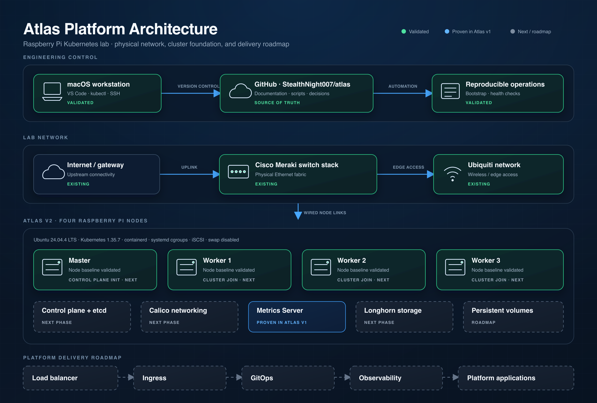

# Atlas

> **A hands-on Platform Engineering lab built on Raspberry Pi, Kubernetes, and modern infrastructure.**

Atlas is my long-term engineering project for building, operating, breaking, fixing, and documenting a production-inspired infrastructure platform.

This repository is intentionally focused on **real engineering work**—recovering systems, automating operations, understanding distributed platforms, and continuously adding new capabilities.

---

# Architecture

[](https://raw.githubusercontent.com/stealthnight007/atlas/main/diagrams/atlas-platform-architecture.png)

[Open the full-size architecture diagram](https://raw.githubusercontent.com/stealthnight007/atlas/main/diagrams/atlas-platform-architecture.png)

The architecture distinguishes the current rebuild state from the target platform and intentionally excludes sensitive infrastructure details.

---

# Current Platform

## Infrastructure

- Raspberry Pi Kubernetes cluster

- Ubuntu Server

- Kubernetes (kubeadm)

- containerd

- Calico networking (reinstallation pending)

- etcd control plane

- Cisco Meraki networking

- Ubiquiti networking

- macOS development workstation

- GitHub

- Visual Studio Code

---

# Current Capabilities

- ✅ Reproducible Ubuntu 24.04 Kubernetes host baseline

- ✅ Kubernetes v1.35.7 control plane

- ✅ Control-plane health validation

- ⏳ Cluster networking and worker rejoin

- ⏳ Resource Metrics restoration on the rebuilt cluster

- ⏳ Persistent storage restoration

---

# Milestones

| Status | Milestone |

|---------|-----------|

| ✅ | [001 — Lab Discovery](docs/milestones/001-lab-discovery.md) |

| ✅ | [002 — Kubernetes Foundation](docs/milestones/002-kubernetes-foundation.md) |

| ✅ | [003 — Resource Metrics](docs/milestones/003-resource-metrics.md) |

| ✅ | [004 — Platform Modernization](docs/milestones/004-platform-modernization.md) |

| ✅ | [005 — Control Plane Reconstitution](docs/milestones/005-control-plane-reconstitution.md) |

| ⏳ | 006 — Cluster Networking and Worker Rejoin |

| ⏳ | 007 — Distributed Storage |

| ⏳ | 008 — Load Balancing and Ingress |

| ⏳ | 009 — GitOps and Platform Applications |

---

# Repository Structure

```text

atlas/

├── docs/

│   ├── milestones/

│   ├── runbooks/

│   └── troubleshooting/

├── diagrams/

├── inventory/

├── kubernetes/

├── network/

├── scripts/

├── terraform/

└── README.md

```

---

# Engineering Philosophy

Atlas is built around a few principles:

- Build real systems.

- Recover failures instead of rebuilding immediately.

- Learn by understanding—not memorizing.

- Automate repetitive operational work.

- Document important engineering decisions.

- Build one capability at a time.

---

# Current Focus

The current objective is evolving Atlas into a complete self-hosted platform capable of running production-inspired workloads while documenting every significant engineering milestone.

---

# Roadmap

## Platform

- Kubernetes Foundation ✅

- Resource Metrics ✅

- Platform Modernization ✅

- Control Plane Reconstitution ✅

- Cluster Networking and Worker Rejoin

- Resource Metrics Restoration

- Distributed Storage

- Load Balancing

- Ingress

- GitOps

- Observability

## Infrastructure

- Terraform

- GitHub Actions

- Infrastructure as Code

- CI/CD Pipelines

## Applications

- Self-hosted services

- AI workloads

- Platform services

- Internal tooling

---

# Long-Term Vision

Atlas isn't a tutorial.

It isn't a certification lab.

It isn't a collection of random experiments.

It's a continuously evolving engineering platform where every milestone adds a new operational capability and every challenge becomes part of the learning process.

---

> **Build. Break. Learn. Repeat.**
