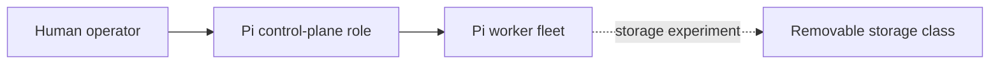
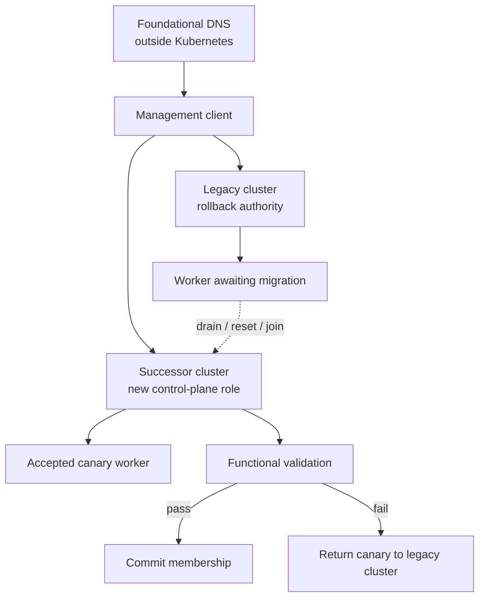
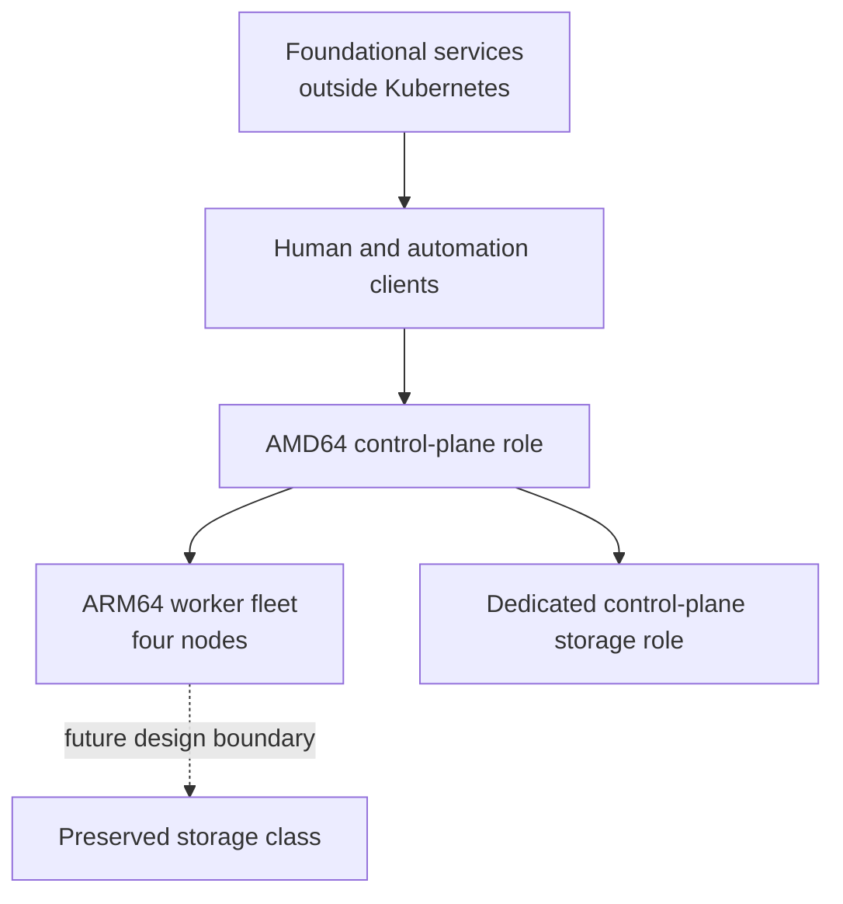
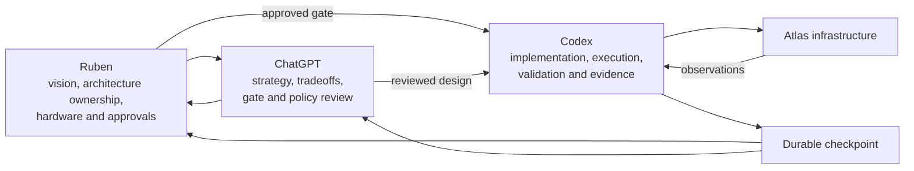
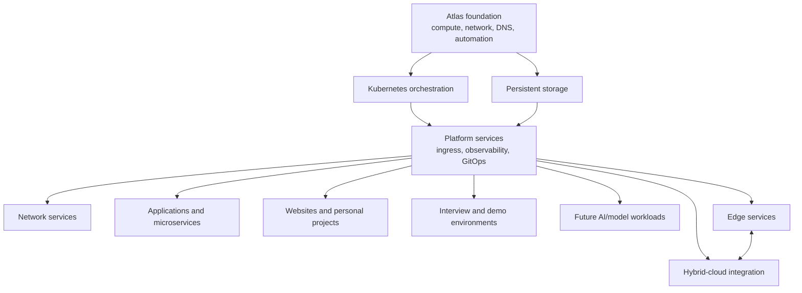

# Atlas Migration-Era Architecture

These diagrams deliberately show roles and trust relationships rather than the
live network. Addresses, VLAN identifiers, device identifiers, credentials,
security-policy values, and recovery paths are omitted.

## 1. Original Pi-only cluster

The original platform was valuable precisely because it was real: small,
resource-constrained machines exposed operating-system, networking, datastore,
and storage behavior that a disposable tutorial cluster would have hidden.

## 2. Transitional dual-cluster migration

Both clusters existed intentionally. A node was not considered migrated merely
because it became Ready; service, routing, DNS, host, and both-cluster health
had to pass before legacy recovery access was surrendered.

## 3. Final heterogeneous cluster

Atlas Prime carries the sole control-plane role, and the four Pis form the
worker fleet. The fourth worker is the former Pi control plane. Preserved
storage remains outside the active platform until a fresh design is approved.
The diagram intentionally aggregates hosts and does not show the live network,
service placement, or recovery path.

## 4. Team Atlas operating model

Atlas is human-led and AI-assisted. Architecture authority and physical control
remain with Ruben; ChatGPT supports reasoning and review; Codex acts as the
infrastructure and automation engineering arm after a gate is approved.

## 5. Future platform vision

Kubernetes is a current substrate, not the definition of Project Atlas. The
project is a growing personal infrastructure and mini-datacenter platform that
can combine on-premises compute, storage, networking, edge delivery, and cloud
services over time.
